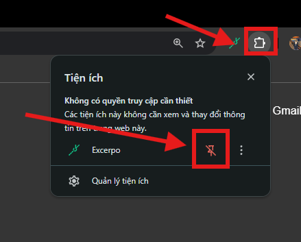
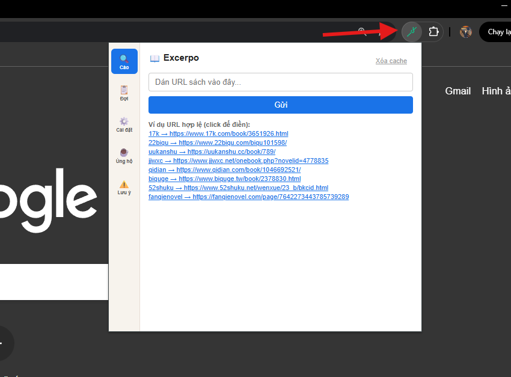

#  Excerpo
**Công cụ trích xuất và tải truyện/text tự động từ đa nền tảng**

## 🌟 Giới thiệu
**Excerpo** (tiếng Latin: "Trích xuất", "Gặt hái") là một tiện ích mở rộng (Browser Extension) mạnh mẽ, được thiết kế chuyên biệt để tự động thu thập văn bản, nội dung truyện chữ từ các trang web đọc truyện hàng đầu. 

Mục đích chính của công cụ là phục vụ cho nhu cầu lưu trữ offline cá nhân, nghiên cứu kỹ thuật xử lý ngôn ngữ và hỗ trợ dịch thuật tự động.

## 📷 Ảnh chụp màn hình

| 🎯 Giao diện chính (Cào dữ liệu) | ⏳ Hàng đợi tải ngầm (Quản lý tiến độ) |
| :---: | :---: |
|  |  |
| **⚙️ Bảng Cài đặt (Định dạng & Thư mục)** | **⚠️ Điều khoản & Lưu ý sử dụng** |
|  |  |

## 🚀 Tính năng nổi bật
* **Đa nền tảng:** Hỗ trợ quét và tải mượt mà từ hàng loạt nền tảng đọc truyện trực tuyến, chia theo các quốc gia:
  -  **Trung Quốc (Giản thể):** `17k`, `22biqu`, `23qb`, `52shuku`, `69shuba`, `69shumi`, `biquge`, `xbiquge`, `bookqq`, `fanqienovel`, `hetushu`, `ihuaben`, `ixdzs8`, `jjwxc`, `novel543`, `powanjuan`, `qidian`, `shubaow`, `shuhaige`, `uukanshu`, `xbanxia`.
  -  **Đài Loan (Phồn thể):** `po18`, `sto9`, `sto55`, `ttkan`, `twkan`.
  -  **Nhật Bản:** `kakuyomu`, `pixiv`, `syosetu`, `syosetu.org`.
  -  **Âu Mỹ / Toàn cầu:** `ao3`, `fictionpress`, `foxaholic`, `lnmtl`, `novellunar`, `royalroad`, `scribblehub`.
  -  **Thổ Nhĩ Kỳ:** `fenrirscans`.
  -  **Nga:** `ranobelib`.
  -  **Brazil:** `centralnovel`, `phoenixnovels`.
  -  **Indonesia:** `meionovel`, `novelgo`, `wbnovel`.
  -  **Pháp:** `chireads`.
* **Auto-Bypass Rate Limit & Captcha:** Tích hợp OCR (Tesseract.js) chạy ngầm để đọc và khi cào dữ liệu, cũng như thuật toán delay thông minh tránh bị chặn IP.
* **Tải ngầm đa luồng:** Hoạt động độc lập bằng Service Worker dưới nền. Bạn có thể lướt web bình thường, tắt tab, tool vẫn kiên nhẫn tải hàng ngàn chương mà không lo đứt gãy.
* **Tuỳ biến File & Định dạng linh hoạt:** Cho phép trích xuất ra định dạng văn bản chuẩn `.txt` hoặc tệp Word `.docx` cực nhẹ. Hỗ trợ tự do cấu hình quy tắc đặt tên file (VD: `chuong-{index}_{title}`).

## ⚙️ Hướng dẫn cài đặt
Vì đây là phiên bản dành cho nhà phát triển, bạn có thể dễ dàng cài đặt tiện ích này thông qua chế độ **Developer Mode** của trình duyệt.
1. Nhấn nút màu xanh `Code` -> **Download ZIP** và giải nén thư mục ra máy tính.
    
2. Mở trình duyệt, truy cập vào trang Quản lý tiện ích (hoặc nhấp vào 1 trong các link dưới):
   * Chrome: `chrome://extensions/`
   * Edge: `edge://extensions/`
   * Cốc Cốc: `coccoc://extensions/`
    
3. Bật **Chế độ dành cho nhà phát triển (Developer mode)** ở góc trên bên phải.
    
4. Chọn **Tải tiện ích đã giải nén (Load unpacked)** và trỏ tới thư mục Excerpo bạn vừa giải nén.
    
5. Chọn vào biểu tượng tiện ích mở rộng và chọn ghim tiện ích Excerpo.
    
6. Trải nghiệm thôi. Chúc các bạn may mắn
    
## ⚠️ Khuyến nghị cài đặt Trình duyệt (Quan trọng)
Để công cụ có thể tự động lưu hàng ngàn tệp tin mà không bị treo máy bởi các hộp thoại hỏi vòng lặp:
* Đi tới `chrome://settings/downloads`.
* Chọn thư mục gốc để lưu tệp tin (Excerpo sẽ tự động tạo thư mục con theo tên truyện bên trong thư mục gốc này).
* **TẮT** tuỳ chọn: *"Hỏi vị trí lưu từng tệp trước khi tải xuống"*.

  

## ⚖️ Điều khoản & Miễn trừ trách nhiệm
Excerpo được cung cấp **miễn phí cho mục đích sử dụng cá nhân**. Để duy trì chi phí phát triển, khi bạn nhấn nút "Gửi" để bắt đầu tải truyện, công cụ sẽ tự động nhảy sang một tab quảng cáo mới (tab này sẽ tự động đóng lại sau 60 giây). Rất mong sự thông cảm và ủng hộ từ các bạn!

Người dùng chịu trách nhiệm hoàn toàn về các hành vi chia sẻ công cộng dữ liệu tải về.
> Nếu bạn muốn tải các chương truyện khóa (VIP), xin vui lòng **mua chương** để tôn trọng chất xám của tác giả gốc trên website trước. Công cụ này chỉ trích xuất những gì màn hình của bạn được cấp quyền hiển thị.

---
*Phát triển bởi [Hung000anh](https://github.com/Hung000anh) - ☕ Cảm ơn bạn đã đồng hành!*
